<div align="center">
  
</div>

<br/>

<div align="center">

[](https://github.com/soham-1902)

</div>

---

```python
# ┌──────────────────────────────────────────────────────┐
# │   soham.py — run this to understand who I am         │
# └──────────────────────────────────────────────────────┘

class SohamPande:
    name       = "Soham Pande"
    title      = "AI Engineer & Mobile Developer"
    origin     = "Pune, India 🇮🇳"
    building   = "LLM agents that think before they speak"
    open_to    = "Collabs on AI products that actually matter"

    stack = {
        "AI / ML"   : ["PyTorch", "HuggingFace 🤗", "LangChain", "OpenAI API", "RAG", "Agents"],
        "Mobile"    : ["Flutter", "Dart", "Firebase"],
        "Backend"   : ["Python", "FastAPI", "Docker"],
        "Languages" : ["C++", "Java", "Python"],
        "Design"    : ["Figma"],
    }

    currently  = "Building an LLM pipeline that gives me fewer surprises than my team does"
    fun_fact   = "I trained a bot on myself. It answers recruiter DMs. It's better at it than I am."

soham = SohamPande()
# ↓ or just talk to the bot directly
```

---

## ↳ SOHAMBOT — *There's an AI version of me. It's online right now.*

<div align="center">

> I built an AI agent trained on my personality, projects, skills, and opinions.
> It answers questions about me. On my behalf. 24/7.
> It will tell you whether to hire me. (It will say yes.)

### **[→ Talk to SohamBot](https://soham-1902.github.io/sohambot)**

*Ask it: "What's your best project?" · "Are you available?" · "Explain your AI stack" · "Should I hire you?"*

</div>

---

## ↳ PLAY CHESS WITH ME — *yes, on this page, right now*

<div align="center">

> This is a real, community-driven chess game. Make a move by clicking a link below.
> GitHub Actions will update the board automatically. You vs me (and everyone else).

### [→ View the live board & make your move](https://github.com/soham-1902/chess)

*Built with GitHub Issues + Actions. Every move is a commit. The board never sleeps.*

</div>

---

## ↳ STACK

<div align="center">

**// AI · ML**


**// MOBILE · BACKEND**


**// LANGUAGES**


</div>

---

## ↳ ACTIVITY

<div align="center">
  
</div>

<div align="center">
  
  &nbsp;
  
</div>

<div align="center">
  
</div>

---

## ↳ WAKA — *how I actually spend my hours*

<div align="center">

[](https://wakatime.com/@soham-1902)

<!--START_SECTION:waka-->
<!-- This updates automatically via GitHub Actions once you connect WakaTime -->
<!--END_SECTION:waka-->

</div>

---

## ↳ CONNECT

<div align="center">

[](https://www.linkedin.com/in/soham-pande-a446b9198/)
&nbsp;&nbsp;
[](mailto:sohampande1902@gmail.com)
&nbsp;&nbsp;
[](https://discordapp.com/users/744599283243810856)
&nbsp;&nbsp;
[](https://soham-1902.github.io/sohambot)

<br/>

*"The best AI engineers don't just use models — they think like them."*

</div>

---

<div align="center">
  
  <br/><br/>
  <sub><code>// every commit is a synapse firing. keep training.</code></sub>
  <br/>
  
</div>
