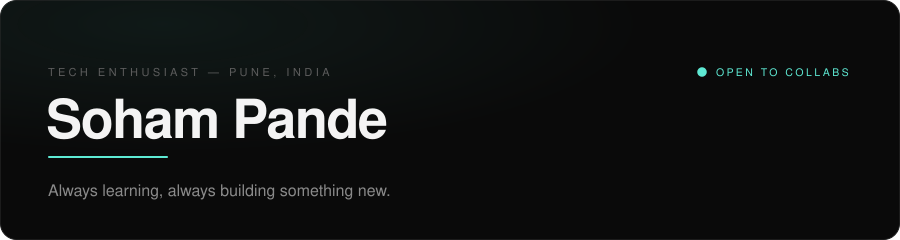
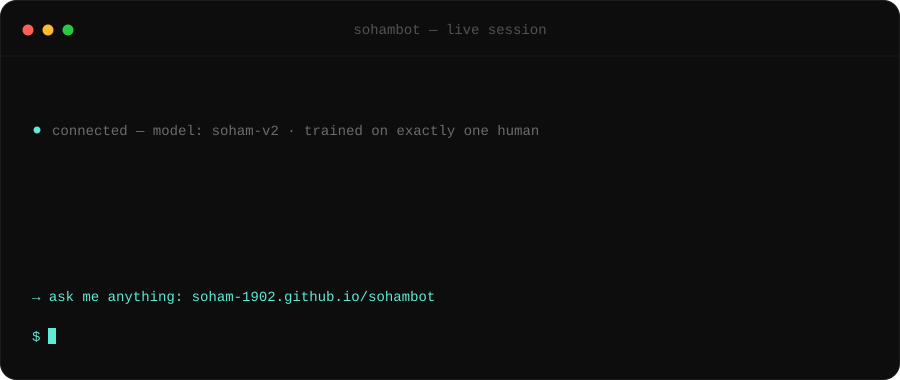
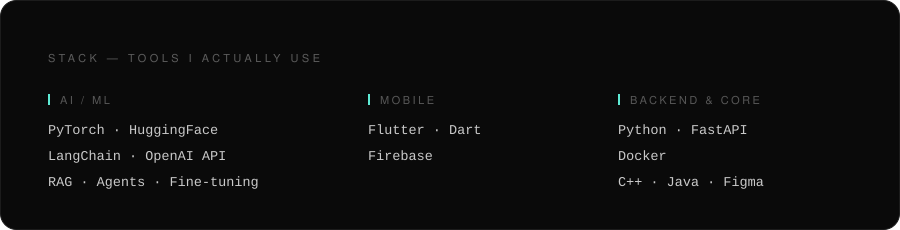

  

 

  

  the bot is real, and it's online right now — <a href="https://soham-1902.github.io/sohambot"><b>talk to it →</b></a>

 
 

  

 

  <samp>
    <a href="https://www.linkedin.com/in/soham-pande-a446b9198/">linkedin</a>
    &nbsp;·&nbsp;
    <a href="mailto:sohampande1902@gmail.com">email</a>
    &nbsp;·&nbsp;
    <a href="https://discordapp.com/users/744599283243810856">discord</a>
    &nbsp;·&nbsp;
    <a href="https://soham-1902.github.io/sohambot"><b>sohambot</b></a>
  </samp>

 
 

  

 

  

